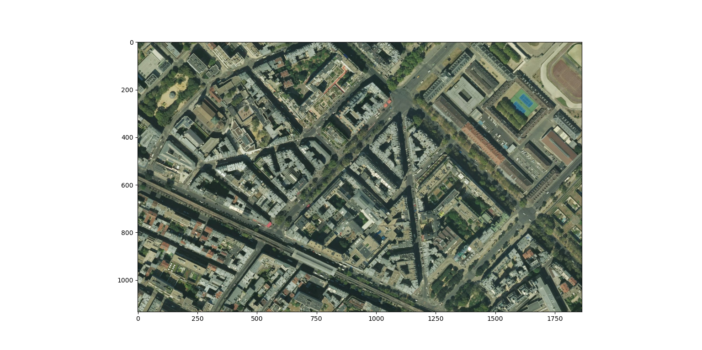

# satellite images query

This is a Python module to query satellite images for applications in machine learning.
You can choose the window of GPS coordinates and the resolution.

The code is available under [CC-BY licence](https://fr.wikipedia.org/wiki/Licence_Creative_Commons) (can be modified, shared, and used for commerciale applications).
The tiles are queried from the [MapTiler](https://www.maptiler.com) rest API, but you can modify the url in the "_tile_file" function to use any other provider.
Similarly to google maps, the images provided by MapTiler are in [mercator projection](https://en.wikipedia.org/wiki/Mercator_projection), so the further away from the equator the more stretched, and latitudes below -85.05°/over 85.05° are not available.

## How to use

Create a free [MapTiler](https://www.maptiler.com/) account. You can find your API key in **Account**/**Keys**.
You can then run the sample code here below to download an image as a numpy array, and display it using matplotlib.

```python
import satellite_images
import matplotlib.pyplot as plt

lat_min, lon_min = (48.848, 2.295)
lat_max, lon_max = (48.852, 2.305)
API_KEY = "your_key_here"
image = satellite_images.query((lat_min, lon_min), (lat_max, lon_max), key=API_KEY, resolution="auto")
plt.imshow(image)
plt.show()
```





The resolution can be either "min", "auto" (512 pixels wide image), "max", or the number of ° of longitude per pixel.
If you set the resolution too high, the function will have to query a lot of tiles to create the image, which will slow donw the process.


Some functions to convert coordinates between GPS and Mercator ([0, 0] at bottom left of the mercator map, [1, 1] at the top right) are provided.
There are also functions to convert from coordinates (GPS and Mercator) to (y, x) position in the image.


## Demonstration


Here is an example that illustrates that the image corresponds to the requested coordinates:
I downloaded land plot coordinates from the cadastral register, and have drawn the polygons over the satelite image.


